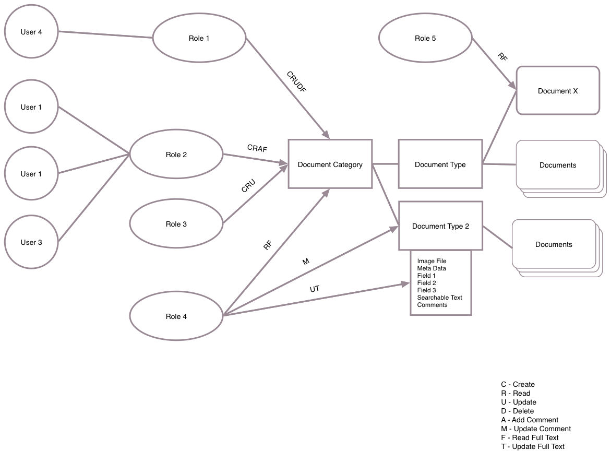

= Security
There are multiple layers of security within Monument. System level security, configuration security and document security.

== System Level Security
* Encryption of images
* Security of data store
* Web-service security
* Authentication
* Authorization

== Configuration Security
In order to enforce document level security, the system must be configured.
Security around who can configure the system must also exist. For example,
someone must configure the document owner and document classes. This is
typically done by a documents manager and that manager needs to be assigned a
role with these privileges. A set of permissions are defined for configuration
of the system, they are:

System Control:: Can define new document owners, has permissions to assist owners
to configure their document controls, has full role controls and has
configuration controls that effect the system as a whole.

Document Control:: Can define document types, definitions of documents, add new
field type definitions, setup document retention policies, setup version
controls, etc.

Role Control:: Can assign permissions to roles, can assign roles to documents.
...:: others to be defined

== Document Security
Documents have a varied set of permissions providing fine grained control of
what users can do with each document. Permissions are always additive, except
when document fields are defined to be limited. These permissions are:

Create:: User can create a new document, storing the file and its meta-data into the system.
Read:: User can search document meta-data, comments and retrieve the document.
Update:: User can modify the document meta-data (if document defines that the data is modifiable)
Delete:: User can delete the document from the system. [Should we use a "Trash"?]
Add Comment:: User can add comments to a document.
Update Comment:: User can modify and delete comments of a document.
Read Full Text:: Document's searchable text is exposed to the user and when a search is performed will return the document if matching text is found. User is allowed to view searchable text.
Update Full Text:: User can modify the searchable text.

=== Category Level
A role can be given permissions at an entire document category level. If the document type has roles/permissions associated with it, the permissions will be added to the category level.

=== Type Level
A role can be given permissions at the document type level.

=== Document Level
A specific document can be given specific permissions through a role.

=== Field Level
Each field of a document type is defined through the configuration security. The field is defined with a type, validation, required, and modifiable. Special fields are preconfigured with settings in the system. For example:

* Document Cateogry - *Type:* String, *Validation:* Defined category, *Required:* true, *Modifiable:* false
* Document Type - *Type:* String, *Validation:* Defined category, *Required:* true, *Modifiable:* false

== Example Security Definition
Here is an example image of a set documents and their defined security.
[[img-sunset]]

